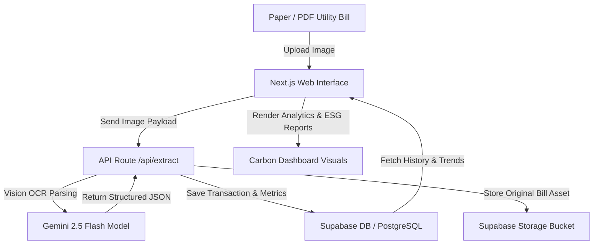

# 🌿 EcoTrack AI

[](LICENSE)
[](https://nextjs.org/)
[](https://www.typescriptlang.org/)
[](https://supabase.com/)
[](https://deepmind.google/technologies/gemini/)

> **"Automating sustainability metrics by bridging the physical-to-digital gap. Extract consumption metrics from paper bills using multimodal AI, track historic emissions, and build Net Zero action plans."**

EcoTrack AI is an enterprise-grade full-stack sustainability platform designed to eliminate the friction of carbon accounting. It uses **Gemini 2.5 Flash** for vision-based OCR data extraction from utility bills and logs telemetry to **Supabase (PostgreSQL)** for dashboard visualizer analytics.

---

## 🗺️ Architectural Workflow



---

## ✨ Core Features

1. **Multimodal Bill Extraction**: Upload images or PDFs of utility bills (electric, water, gas) to auto-extract date, total cost, and consumption metrics (kWh, gallons) with zero manual entry.
2. **ESG Metric Translation**: Automatically calculates CO₂ emissions mass based on regional grid emission intensity factors.
3. **Historical Trend Analysis**: Track consumption patterns month-over-month to target efficiency improvements and track Net Zero targets.
4. **Secure Asset Storage**: Retain digital copies of original bills in Supabase Storage Buckets for financial and compliance audit trials.

---

## 📂 Repository Structure

```
EcoTrack/
├── ecotrack-ai/       # Next.js TypeScript App (Frontend & API)
└── README.md          # Root-level Project Documentation
```

---

## ⚙️ Configuration & Environment Setup

Create a `.env.local` file inside the `ecotrack-ai/` directory:

```bash
NEXT_PUBLIC_SUPABASE_URL=your_supabase_project_url
NEXT_PUBLIC_SUPABASE_ANON_KEY=your_supabase_anon_public_key
GEMINI_API_KEY=your_google_gemini_api_key
```

---

## 🚀 Running EcoTrack AI locally

Requires Node.js 18+.

```bash
cd ecotrack-ai

# Install dependencies
npm install

# Run the development server
npm run dev
```

Open `http://localhost:3000` to view the carbon dashboard.

---

## 📊 Scientific Calculation Model
EcoTrack AI converts electricity consumption directly to greenhouse gas equivalent emissions:
$$\text{Total } CO_2 \ (kg) = \text{Consumption } (kWh) \times 0.695$$

*Note: The grid intensity factor (0.695) is configured at the API route level and can be customized to match local utility grids.*

---

## 🤝 License

Distributed under the [MIT License](LICENSE).
